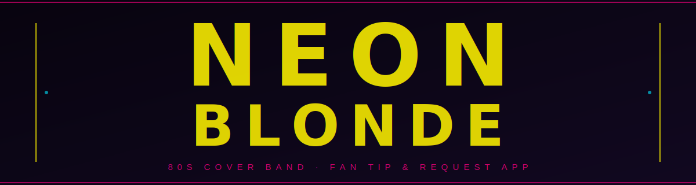

# Neon Blonde — Fan Tip & Request App

A mobile-first web app fans access via QR code at gigs. Single file, no framework, deploys anywhere.

---

## Features

| | Feature | Description |
|---|---|---|
| 💸 | **Tip Us** | Opens Venmo with amount pre-filled ($5 / $10 / $20 or custom) |
| 🎵 | **Request a Song** | Fan submits song + contact info. Band reviews, sends $100 Venmo request if accepted. You pay, we play. |
| 🔥 | **Fund a Song** | Leaderboard of band-curated songs. Fans chip in. Most funded gets played as soon as it's ready — at a SB/Ventura venue of their choice. Full refund if it never happens. |

---

## Files

```
neon-blonde-app/
├── index.html          ← the entire app (single file)
├── Dharma Punk.ttf     ← band font (must stay alongside index.html)
├── google-apps-script.js  ← backend script for Google Apps Script
└── banner.svg          ← this README's header
```

---

## Quick Setup

### 1. Deploy the backend (one time)
Open the existing Apps Script project as `neonblondevc@gmail.com`:

> `script.google.com/home/projects/1ES6kjEglUz8u8Yp4thzeIaiDt_mzTZRyn42OnoEMGRkhAI9sVyoeHYL8/edit`

**Deploy → New deployment → Web App**
- Execute as: **Me**
- Who has access: **Anyone**

Copy the Web App URL.

### 2. Wire it into the app
In `index.html`, find this line near the top of the `<script>` block:

```js
const SHEET_ENDPOINT = 'YOUR_APPS_SCRIPT_WEB_APP_URL_HERE';
```

Replace the placeholder with your Web App URL.

### 3. Host on GitHub Pages
- Push these files to a public repo
- **Settings → Pages → Source: main / root**
- Your URL: `https://YOUR-USERNAME.github.io/neon-blonde-app`

Point your QR code at that URL.

---

## Google Sheet

Responses auto-populate into three tabs:

| Tab | What's in it |
|-----|---|
| `Sheet1` | Song requests — Song, Artist, Name, Email, Phone, Message, Status |
| `Funding` | Chip-in contributions — Song, Amount, Contact, Status |
| `Songs` | **You populate this** — Song, Artist, Raised, Goal (drives the Fund leaderboard) |

Sheet: [Neon Blonde — Song Requests](https://docs.google.com/spreadsheets/d/118du_vJO1CrfENE6M3LoQWS-HLITf-Yi53eUbzGCNg4)

---

## Updating the App

After any revision session, updated files are written directly to this folder.  
Open **GitHub Desktop → Commit → Push** and the live site updates.

---

*neonblonde.band · @neonblonde*
